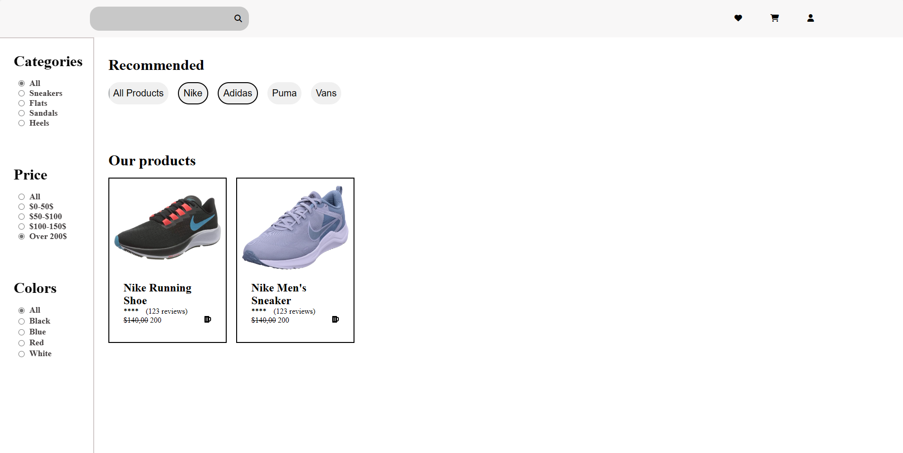
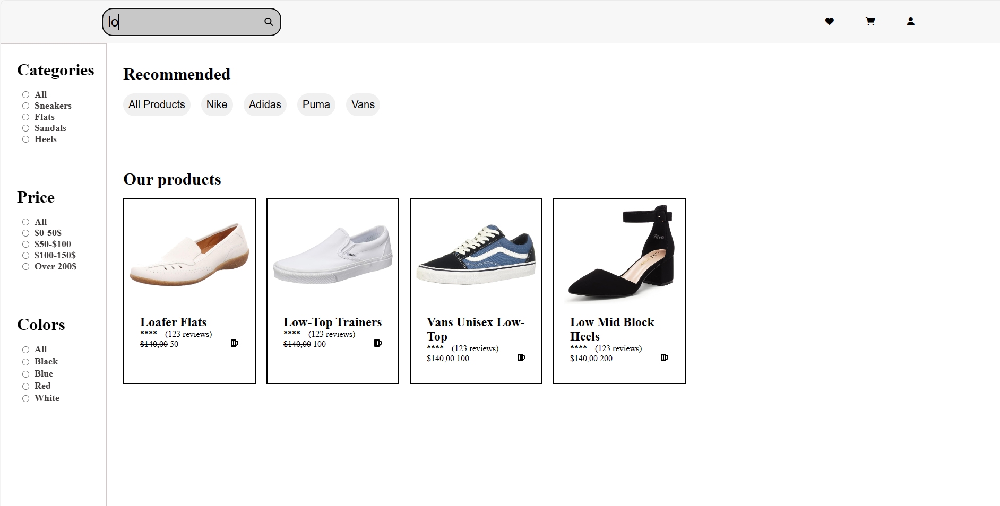

# React Market

React Market is an e-commerce web application built using React and Redux Toolkit. It allows users to search for products, filter items by various criteria such as colors, price range, and categories, and browse products from different companies.

## Table of Contents

- [Description](#description)
- [Installation](#installation)
- [Usage](#usage)
- [Features](#features)
- [Contributing](#contributing)
- [Preview](#preview)

## Description

React Market is a full-featured e-commerce platform designed to provide users with a seamless shopping experience. It includes the following key features:

- **Product Search:** Users can search for products by typing keywords into the search box.

- **Filtering Options:** Users can filter products based on the following criteria:
  - **Colors:** Filter products by color using radio buttons.
  - **Price Range:** Adjust a price range filter to view products within a specific budget.
  - **Categories:** Filter products by category using radio buttons.

- **Company Filters:** Users can filter products by the name of the company using a group of buttons.

The application is built using Redux Toolkit, which simplifies state management, and React for a responsive user interface.


## Installation

To run the React Market application locally:

1. Clone this repository to your local machine:

   ```bash
   git clone https://github.com/mustafawardeh/react-market.git
2. Navigate to the project directory:
  cd react-market
3. Install the required dependencies:
  npm install
4. Start the development server:
  npm start
5. Open your web browser and go to access the application.

## Usage

-Responsive and user-friendly interface.
-Real-time product search functionality.
-Customizable filters for colors, price range, and categories.
-Company-specific product filtering.
-State management using Redux Toolkit for efficient data handling.

## Contributing
Contributions to this project are welcome! If you'd like to contribute:

1-Fork the repository on GitHub.
2-Make your changes or additions to the code.
3-Test your changes to ensure they work as expected.
4-Submit a pull request with a clear description of your contribution.


## Preview

### Buttons And CheckBoxes Filter



### Search Filter

